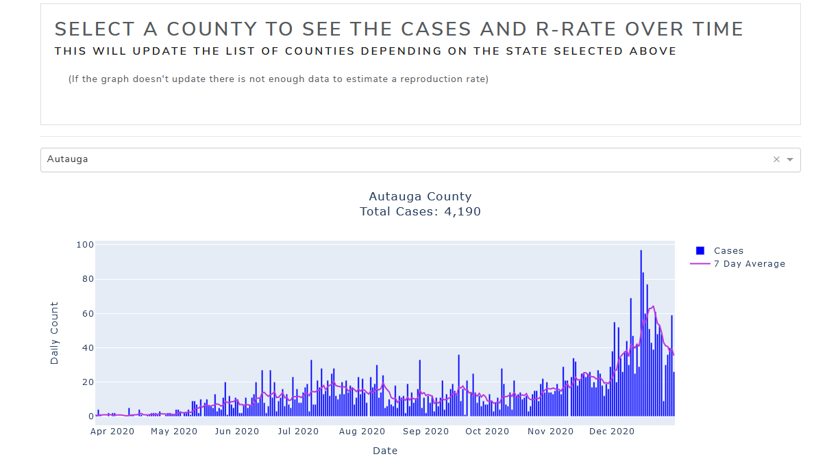
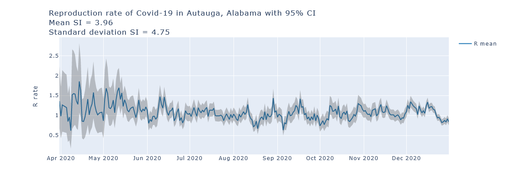

# Covid-19-tracking-USA
Tracking and visualizing the spread of covid-19 on a local level within each state and county in the United States.
### Data
[Johns Hopkins Data Repo](https://github.com/CSSEGISandData/COVID-19)

Data was collected and cleaned using the pandas library in Python.
R-rate was calculated in the EpiEstim library in R.
Visuals were generated using [plotly library](https://plotly.com/) in Python. Dashboard was built using [dash library](https://plotly.com/dash/).

The website was built to create comprehensive interactive visuals of the Covid-19 cases/deaths in the United States, along with estimating the R-Rate on a state and county level.
First an overview is shown on the app:

Next a bar chart is used to display the cases and deaths in the United States over time:

A choropleth map of the United States with boundaries at the state level is shown for the R-rate:

And an interactive scatter plot is designed to show the change of r-rate per state over time:

As you go down the website it gets more specific to the state and county level.
So the next visual is a sunburst that gives a proportion breakdown of the cases by state:

This is then followed by a drop down menu that allows you to specify the state you are interested in, visualizing the cases/deaths along with the R-rate over time:

Upon selecting a state, you can now dive deeper into the county level for the selected state:

And near the bottom of the page you can view the choropleth, proportion sunburst, and 30-day scatter plot for each state selected:

To view the web app please see the link below:

[Dashborad App](https://covid-19-tracking-dashapp.ue.r.appspot.com/) (Website is no longer being updated with data as of 01/01/2021)
